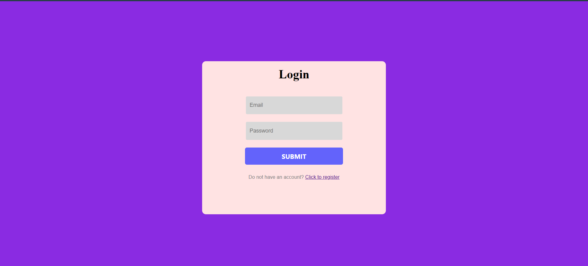
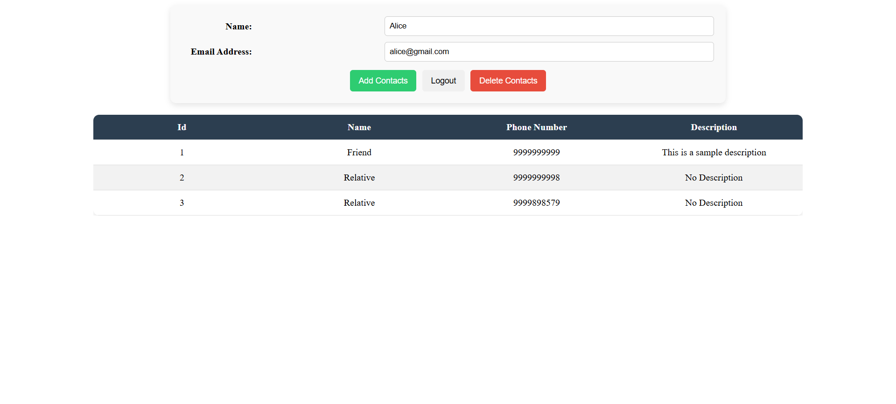
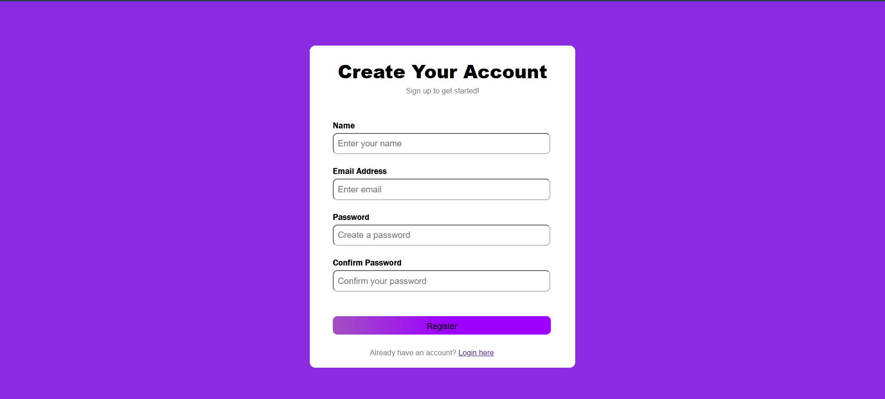

### 📖 **Contact Book Web App**  
A full-stack **MERN-based Contact Book** that allows users to manage their personal and professional contacts efficiently.

---

## 🚀 **Features**
✅ User Authentication (Signup & Login) 
✅ Add, Edit, and Delete Contacts  
✅ Secure API with Middleware  
✅ Responsive UI with React.js  
✅ Backend powered by **Node.js, Express.js, MongoDB**  
✅ Efficient State Management  

---

## 🛠 **Tech Stack**
### **Frontend**  
- React.js (Vite)  
- CSS for styling  
- Axios for API requests  

### **Backend**  
- Node.js, Express.js  
- MongoDB (Mongoose ORM)  
- JWT Authentication  
- dotenv for environment variables  

---

## 📂 **Project Structure**
```
📦 CONTACT-BOOK
├── Backend
│   ├── db
│   │   ├── mongodb.js
│   │   ├── schema.js
│   ├── routes
│   │   ├── contact.js
│   │   ├── user.js
│   │   ├── middlewares.js
│   ├── .env
│   ├── index.js
│
├── frontend
│   ├── public
│   ├── src
│   │   ├── assets
│   │   ├── components
│   │   │   ├── AddContact.jsx
│   │   │   ├── DeleteContact.jsx
│   │   │   ├── Loader.jsx
│   │   │   ├── Login.jsx
│   │   │   ├── SignUp.jsx
│   │   │   ├── User.jsx
│   │   ├── App.jsx
│   │   ├── main.jsx
│   │   ├── index.css
│   │   ├── App.css
|   |   ├── Loader.css
│   │   ├── Signup.css
│   │   ├── User.css
│   ├── package.json
│
├── .gitignore
├── package.json
├── README.md
```

---

## 🎯 **Installation & Setup**
### **1️⃣ Clone the Repository**
```sh
git clone https://github.com/Haritej2003/Contact-Book.git
cd contact-book
```

### **2️⃣ Setup Backend**
```sh

npm install
```
- Create a **.env** file and add:
  ```
  MONGO_URI=your_mongodb_connection_string
  JWT_SECRET=your_secret_key
  PORT = PORT_Number
  SaltRounds = number_of_salt_rounds
  ```

- Run the backend server:
  ```sh
  node index.js
  ```

### **3️⃣ Setup Frontend**
```sh
cd  frontend
npm install
npm run dev
```

---

## 🔗 **API Endpoints**
| Method | Endpoint         | Description         |
|--------|------------------|---------------------|
| POST   | `/api/user/signup` | User Signup      |
| POST   | `/api/user/login`  | User Login        |
| POST   | `/api/user/current-user`  | User Info  |
| POST   | `/api/contact/add`     | Add a Contact     |
| DELETE | `/api/contact?id=contact_id` | Delete a Contact  |

---

## 🎨 **Screenshots**

📌 Login Page  

📌 Contact List UI  

📌 Sign-up Page
  
📌 Add-Contacts Page
 

---

## 💡 **Future Enhancements**
🚀 Implement Search & Filter  
🚀 Add Contact Categories  
🚀 Role-based Access Control  

---

## 🏆 **Contributors**
👨‍💻 **Haritej** - Developer & Maintainer  

---

## 📝 **License**
This project is licensed under the **MIT License**.  

---

